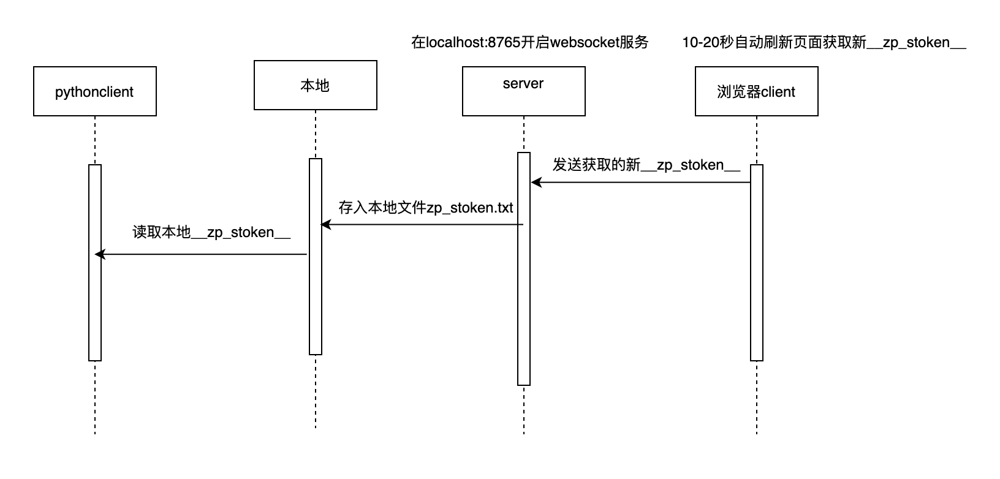

# Boss爬虫
## 原理:根据RPC获取zp_stoken

优点:无需知道具体加密过程, 不用补环境, 被检测的概率最低

# 参数说明
```js
scene = "1"#场景
queryjob = "亚马逊运营"#岗位关键词
city = "101280600"#城市代码
experience = ""#工作经验
payType = ""
partTime = ""
degree = ""#学历要求
industry = ""#公司行业
scale = ""#公司规模
stage = ""#融资阶段
position = ""#职位类型
jobType = ""#求职类型(全职,兼职)
salary = ""#薪资待遇
multiBusinessDistrict = "440307"#区,县
multiSubway = ""#地铁线与站点
page = 1#页数
pageSize = 30#默认一页最多30条招聘信息
````
# 文件结构

```html
├── README.md
├── main.py
├── requirements.txt
├── top
│   └── static.zhipin.com
│       └── zhipin-geek
│           └── v648
│               └── web
│                   └── geek
│                       └── js
│                           └── main.js
├── websocketclient.py
├── websocketserver.py
├── zhipin.py
└── zp_stoken.txt
```
1. `websocketclient.py`websocket客户端定义发送与接收信息
2. `websocketserver.py`websocket服务端接收`__zp_stoken__`
3. `zhipin.py`定义了初始化,搜索和保存函数
4. `main.py`定义所有搜索参数并运行文件
5. `top`需要注入js文件的文件夹, 路径与官网一致

# How to Work
1. 安装依赖库
```sh
pip3 install -r requirements.txt
```
2. 把官网对应main.js文件用本项目的top文件夹覆盖掉, 文件夹路径必须与官网一致, 持久化存储即使关机重启依然存在
```sh
F12打开谷歌工具 > 点击source > 点击page左边>>的Overrides > 勾选Enable Local Overrides > 点击+Select folder for overrides
```
3. 
```sh
cd ./zhipin
```
然后启动websocketserver.py文件
```python
python3 websocketserver.py
```
4. 刷新官网
5. 运行main.py文件
```python
python3 main.py
```
6. 自动保存zhipinjobs.csv到当前文件夹中

